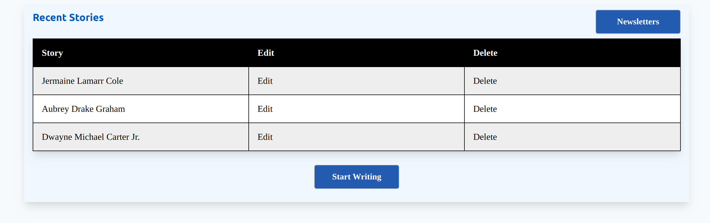
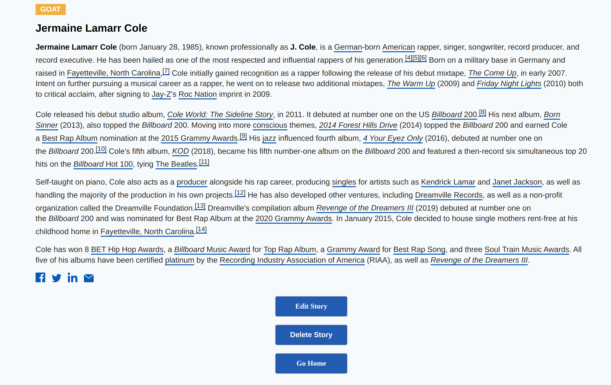

# Mahmud Ahmed's Morningbrew Project
***


## Technologies
* Ruby on Rails
* PostgreSQL
* HTML/CSS

## Installation 

### Pre-requisites

Postgres Database is required for HalalTables to operate correctly.

### Setting up
Please run the following commands:
```
bundle install
bundle exec rails db:create
bundle exec rails db:migrate
bundle exec rails db:seed
```

### Running the app
Please run the following command to start rails server:

```
rails s
```

## Core Functionality:

* Perform all CRUD actions for stories and newsletter with app.

* View an index of all stories and newsletter issues.

* Able to preview an individual story using the given template.

* Stories are nested within a newsletter issue, grouped by date.

* Build and preview newsletter issues based on their dates published. 

* Publish stories and newsletter issues to the Lyra API

* Lyra API is synced for any action that might take place in application. For example, if you DELETE a story in your application, it will also be deleted in Lyra.

* Minimalist UI/UX & Optimized to fit all screen sizes. 


## Preview/Mentions


<p align="center">
  
</p>

* stories/ ":index"

<p align="center">
  
</p>

* stories/:id ":show"

<p align="center">
  
</p>

* Custom Validations for form submission & stories/new ":new"

<p align="center">
  
</p>

<p align="center">
  
</p>

<p align="center">
  
</p>

* newsletters/:id ":index"

<p align="center">
  
</p>

 Select a date and it will auto generate a newsletter with all the stories that were published on the specfied date. To update LyraAPI after posting new stories, just click "Update".

* Syncs with LyraAPI, with inline styling. 

<p align="center">
  
</p>

<p align="center">
  
</p>


## Future Endeavors

* CSS Styling
